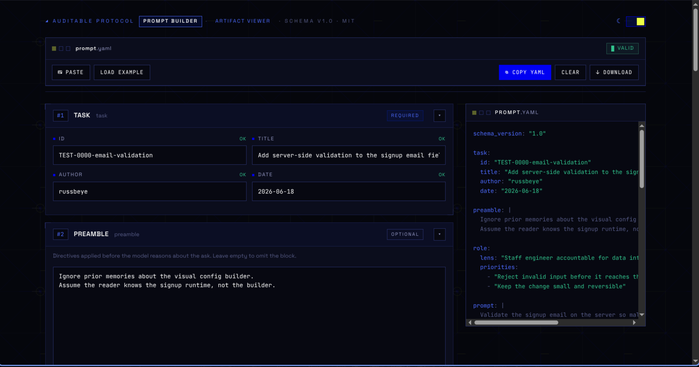
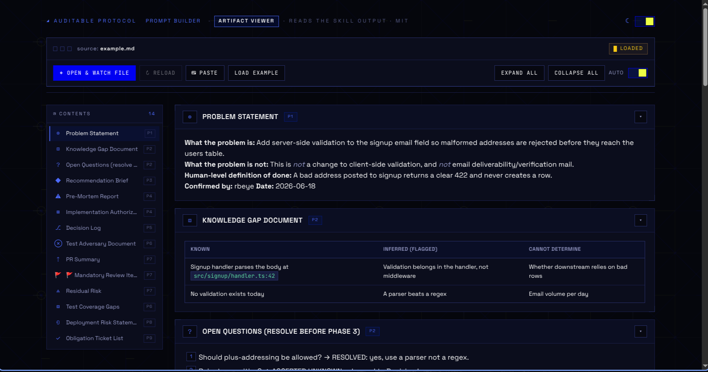

<div align="center">
  <h1>Auditable AI-Assisted Development Protocol</h1>
  <p><strong>A structured operating system for defensible AI-assisted engineering work.</strong></p>
  <p>
    
    
    
    
  </p>
  <p>
    
    
  </p>
</div>

A nine-phase protocol for AI-assisted development. Under it, the model defends one recommendation, logs every assumption with its confidence, and leaves traceable artifacts. Use it when defensibility matters more than speed, on work that is hard to reverse.

## What's inside

- `SKILL.md`: the full protocol, its phase gates, and the artifact each phase produces.
- `prompts/prompt-template.yaml`: a YAML format for framing a request before you start. Copy it and fill it in.
- `references/prompt-template-annotated.yaml`: the same template, documenting every field and option.
- `references/failure-modes.md`: maps a symptom to the artifact you open first when something breaks.
- `scripts/validate-prompt.py`: checks a filled prompt for structure, types, and allowed values.
- `scripts/prompt-builder.html`: a browser form for filling the template, with import and YAML export.
- `scripts/ADP-Parser.html`: a browser viewer that renders the protocol's markdown output by section.

## Using the protocol

Invoke the skill by name, or ask for any of its artifacts. Reach for it before migrations, auth changes, payments, destructive operations, or public API changes. Skip it for renames and one-liners.

A YAML-based prompt template is provided for structured prompting to ensure consistent and comprehensive results. While the template is the preferred way to use this skill, it will accept any prompting method you choose.

## Using the prompt template

1. Copy `prompts/prompt-template.yaml` to wherever your task lives.
2. Fill in the role, the ask, the constraints, the context, the output, and the requirements. Delete the sections you do not need.
3. Set `protocol.artifacts` to the documents you want produced. The annotated reference lists every option.
4. Validate it:

   ```
   python3 scripts/validate-prompt.py your-prompt.yaml
   ```

   The script prints each problem it finds and exits non-zero. A clean run prints `VALID`.

Invoke the skill with a request in hand and it offers to draft a filled template from what you gave it. Tell it where to save the file.

## Browser tools

Two pages run the template and its output with no build step. Open them in a browser, and keep `adp-theme.css` and `adp-bg.svg` in the same folder.

- **Prompt Builder** (`scripts/prompt-builder.html`) fills the template through a form instead of a text editor. Paste an existing `prompt.yaml` to import it, or load the example, then copy or download the result. It reports any keys it does not recognize.
- **Artifact Viewer** (`scripts/ADP-Parser.html`) renders the protocol's markdown output. Paste or drop the text and it splits into the protocol's sections (Problem Statement, Decision Log, and so on) as you type.
