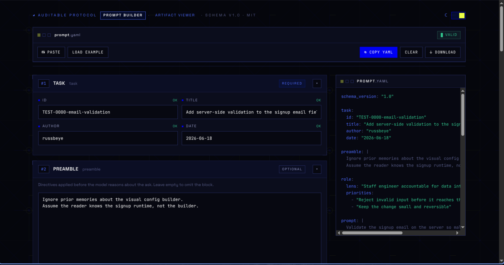
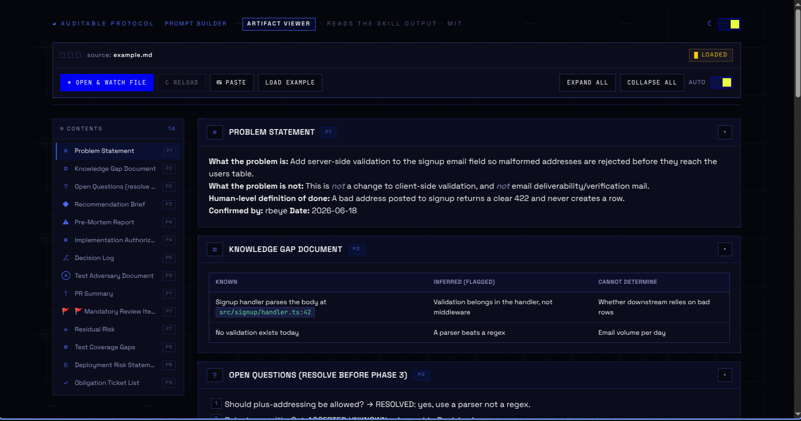

<div align="center">
  <h1>Auditable AI-Assisted Development Protocol</h1>
  <p><strong>A structured operating system for defensible AI-assisted engineering work.</strong></p>
  <p>
    
    
    
    
  </p>
  <p>
    
    
  </p>
</div>

A nine-phase protocol for AI-assisted development. The model defends one recommendation, logs every assumption with a confidence level, and leaves artifacts you can audit later. Use it on work that is hard to reverse, where defensibility matters more than speed.

## What's inside

- `SKILL.md`: the full protocol, its phase gates, and the artifact each phase produces.
- `prompts/prompt-template.yaml`: a YAML format for framing a request before you start. Copy it and fill it in.
- `references/prompt-template-annotated.yaml`: the same template with every field and option documented.
- `references/failure-modes.md`: maps a symptom to the artifact you open first when something breaks.
- `scripts/validate-prompt.py`: checks a filled prompt for structure, types, and allowed values.
- `scripts/prompt-builder.html`: a browser form for filling the template, with import and YAML export.
- `scripts/ADP-Parser.html`: a browser viewer that watches the audit log and renders it by section. This is the protocol's observability layer.
- `scripts/adp-serve.py`: a localhost server that opens the viewer already attached to the audit log, so watching starts without any clicks.

## Using the protocol

Invoke the skill by name, or ask for any of its artifacts. Reach for it before migrations, auth changes, payments, destructive operations, or public API changes. Skip it for renames and one-liners.

Every run writes its artifacts to `.adp/<task-id>/` at the project root: the audit log at `.adp/<task-id>/audit-log.md`, plus any prompt drafted in session. The skill opens the Artifact Viewer on the audit log and keeps session output to questions, so you watch the run in the viewer rather than the chat. Whether `.adp/` gets committed or gitignored is your call; the skill asks once if the project hasn't decided.

The YAML prompt template is the preferred way to frame a request, but the skill accepts any prompting method you choose.

## Using the prompt template

1. Copy `prompts/prompt-template.yaml` to `.adp/<task-id>/prompt.yaml` in your project.
2. Fill in the role, the ask, the constraints, the context, the output, and the requirements. Delete the sections you do not need.
3. Set `protocol.artifacts` to the documents you want produced. The annotated reference lists every option.
4. Validate it:

   ```
   python3 scripts/validate-prompt.py your-prompt.yaml
   ```

   The script prints each problem it finds and exits non-zero. A clean run prints `VALID`.

Invoke the skill with a request in hand and it offers to draft a filled template from what you gave it, saved to `.adp/<task-id>/prompt.yaml`.

## Browser tools

Two pages run the template and its output with no build step. Open them in a browser, and keep `adp-theme.css` and `adp-bg.svg` in the same folder.

- **Prompt Builder** (`scripts/prompt-builder.html`) fills the template through a form instead of a text editor. Paste an existing `prompt.yaml` to import it, or load the example, then copy or download the result. It reports any keys it does not recognize.
- **Artifact Viewer** (`scripts/ADP-Parser.html`) renders the protocol's markdown output and is the run's observability layer. The skill launches it through `scripts/adp-serve.py`, which serves the page already attached to the audit log and re-renders on every append. Opened by hand, the page still supports Open & watch file (Chromium), paste, and drop.
